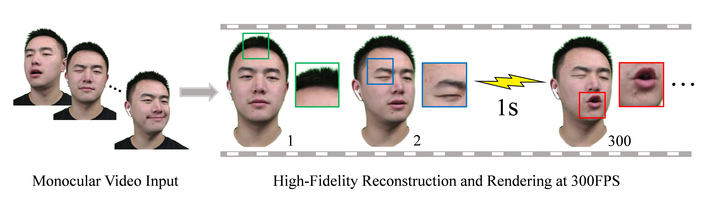

# FlashAvatar
**[Paper](https://arxiv.org/abs/2312.02214)|[Project Page](https://ustc3dv.github.io/FlashAvatar/)**


Given a monocular video sequence, our proposed FlashAvatar can reconstruct a high-fidelity digital avatar in minutes which can be animated and rendered over 300FPS at the resolution of 512×512 with an Nvidia RTX 3090.

## Setup

This code has been tested on Nvidia RTX 3090. 

Create the environment:

```
conda env create --file environment.yml
conda activate FlashAvatar
```

Install PyTorch3D:

```
conda install -c fvcore -c iopath -c conda-forge fvcore iopath
conda install -c bottler nvidiacub
conda install pytorch3d -c pytorch3d
```

## Citation
```
@inproceedings{xiang2024flashavatar,
      author    = {Jun Xiang and Xuan Gao and Yudong Guo and Juyong Zhang},
      title     = {FlashAvatar: High-Fidelity Digital Avatar Rendering at 300FPS},
      booktitle = {The IEEE Conference on Computer Vision and Pattern Recognition (CVPR)},
      year      = {2024},
  }
```
